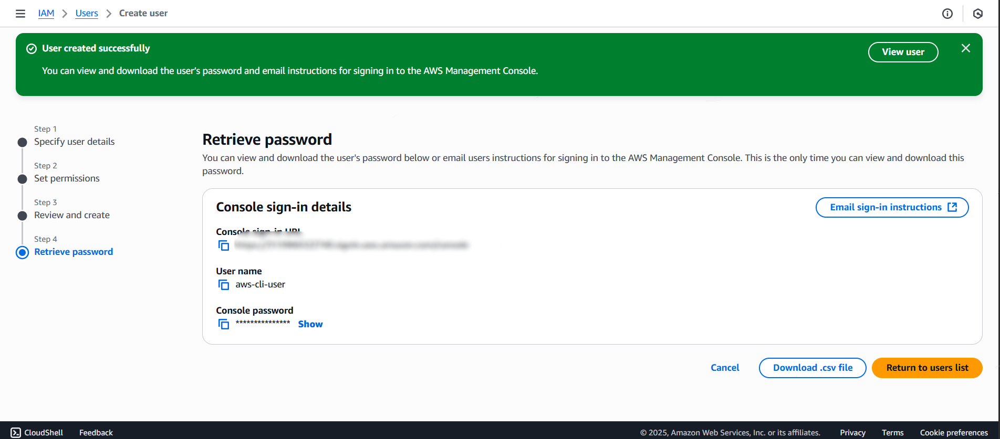
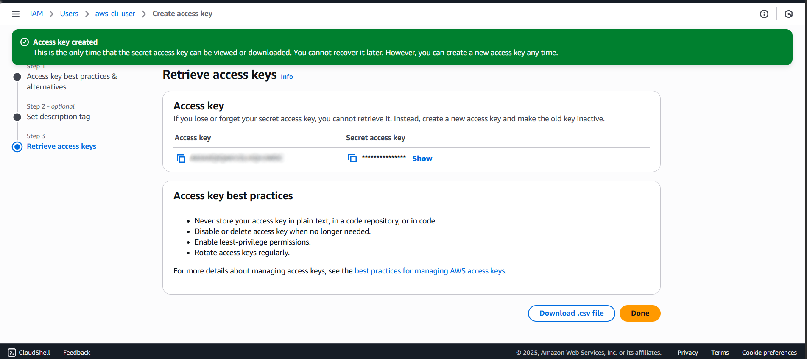
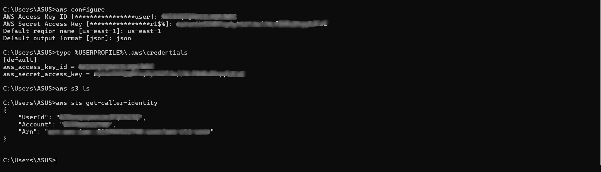

# Day 1 – AWS Basics & IAM
## 🎯 Goal for the Day
To understand the core purpose of **AWS Identity and Access Management (IAM)** and set up secure access for hands-on AWS practice through the CLI.
---
## What is IAM?
AWS **Identity and Access Management (IAM)** is a service that manages who has access to your AWS account and what they can do. It encompasses two primary concepts:
- **Authentication** → Who can log in
- **Authorization** → What they can do
  
🔑 Key Features
- Users → Person or service identities
- Groups → Users with similar permissions
- Roles → Temporary identities taken on to access resources
- Policies → JSON documents that determine permissions

**Best Practice**:
- Never use the root user for everyday work.
- Assign IAM users with console and programmatic access (CLI/SDK).
- Apply the principle of least-privilege (only required permissions).

## 🛠️ Steps-I-followed:
1. **Created IAM User**
   - Went to **IAM → Users → Create user**
   - Enabled **programmatic + console access**
   - Attached `AdministratorAccess` policy (for practice)
   - 📸 *Screenshot:*
     
2. **Generated Access Keys**
   - Downloaded `.csv` with **Access Key ID** and **Secret Access Key**
   - These are used only for CLI/SDK access (not console login)
   - 📸 *Screenshot:*
     
3. **Configured AWS CLI**
   - Ran:
     ```bash
     aws configure
     ```
   - Entered Access Key ID, Secret Access Key, region (`us-east-1`), and output (`json`)
   - 📸 *Screenshot:*
     
4. **Verification Commands**
   After configuration, ran the following to confirm setup:
   ```bash
   type %USERPROFILE%\.aws\credentials
   Shows saved keys in the local AWS credentials file.
   ```
   ```bash
   aws s3 ls
   Lists all S3 buckets in the account (shows empty if none exist as in this case).
   ```
   ```bash
   aws sts get-caller-identity
   Returns the account number, IAM user, and ARN — proves CLI is correctly authenticated.
   ```

✅ End of Day 1
- Learned IAM concepts: users, groups, roles, and policies.
- Created a dedicated IAM user and generated access keys.
- Configured and tested AWS CLI successfully.
