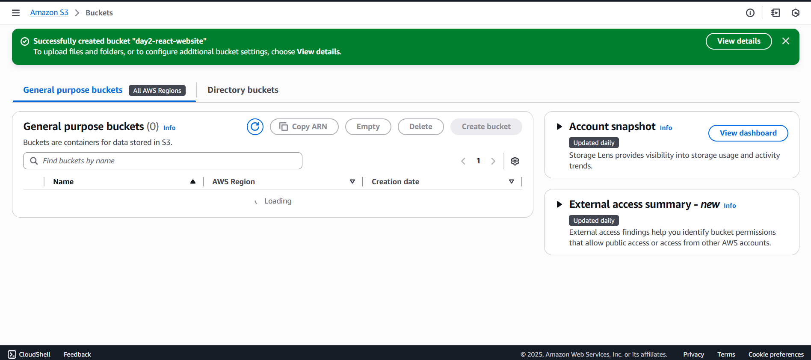

# Day 2 – Static Website Hosting: S3 + CloudFront

## 🎯 Goal for the Day
Host a React-based landing page on **AWS S3** with **CloudFront** for global, fast delivery.

---

## What is S3 + CloudFront?
**Amazon S3 (Simple Storage Service)** is an object storage service for hosting static websites (HTML, CSS, JS, images, videos).  
**Amazon CloudFront** is a content delivery network (CDN) that caches and delivers content from S3 edges worldwide for speed and security.

🔑 Key Features
- S3: Scalable storage with static website hosting enabled via bucket properties.
- CloudFront: Global edge locations, HTTPS enforcement, and integration with S3 origins.
- Bucket Policies: JSON rules for public read access to website objects.

**Best Practice**:
- Use CLI for uploads (`aws s3 sync`) to handle large files efficiently.
- Set `index.html` as both index and error document for React SPAs to handle client-side routing.
- Enable public access only on the bucket, not account-wide.

## 🛠️ Steps-I-followed:
1. **Created S3 Bucket**
   - Went to **S3 Console → Create bucket**  
   - Gave a unique name (e.g., `day2-react-website`)  
   - Region: `us-east-1`  
   - Disabled “Block all public access” 
   - 📸 *Screenshot:*  
     

2. **Uploaded Files via CLI**
   - Built React app:  
     ```bash
     npm run build
     ```
   - Uploaded to S3:
     ```bash
     aws s3 sync dist/ s3://day2-react-website --recursive
     ```
     
     ```bash
     aws s3 sync dist/ s3://day2-react-website --delete
     ```
   - 📸 *Screenshot:*  
     

3. **Enabled Static Website Hosting**
   - S3 → Properties → Static website hosting → Enable  
   - Index document: `index.html`  
   - Error document: `index.html` 
   - 📸 *Screenshot:*  
     

4. **Added Bucket Policy**
   - Allowed public read access:  
     ```json
     {
       "Version": "2012-10-17",
       "Statement": [
         {
           "Sid": "PublicReadGetObject",
           "Effect": "Allow",
           "Principal": "*",
           "Action": "s3:GetObject",
           "Resource": "arn:aws:s3:::day2-react-website/*"
         }
       ]
     }
     ```
   - 📸 *Screenshot:*  
     

5. **Deployed CloudFront Distribution**
   - Created Web Distribution → Origin: S3 bucket  
   - Optional: skipped custom domain & WAF (involves costing) 
   - Default Root Object: `index.html`  
   - 📸 *Screenshot:*  
     

6. **Tested Website**
   - Opened CloudFront URL 
   - Wesbite loaded successfully  
   - 📸 *Screenshot:*  
     

---

✅ End of Day 2
- Successfully hosted and deployed a React SPA on S3 with CloudFront for CDN acceleration.
- Learned to configure public access, static hosting, and bucket policies for secure static sites.
- CLI sync with `--recursive` & `--delete` ensures builds stay in sync; CloudFront enables HTTPS and global speed.
