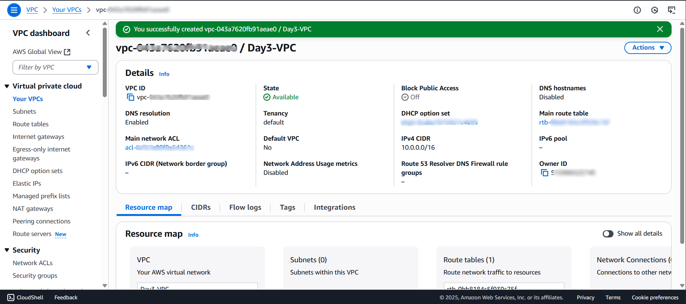
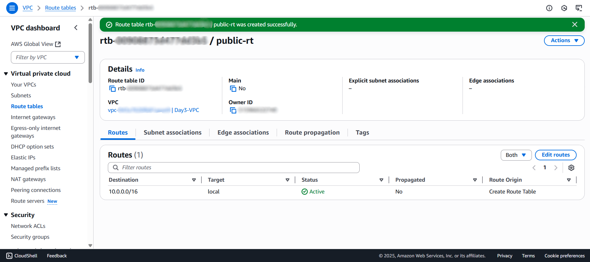
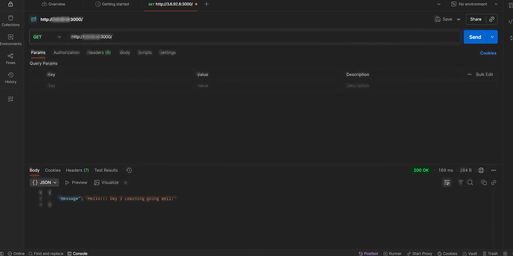

# Day 3 – Compute & Networking: EC2 + VPC

**Goal:** Deploy a Node/Express API on an EC2 instance inside a custom VPC, demonstrating compute and networking fundamentals in AWS.

---

## 1️⃣ Major Concepts I Learned

### **1. VPC (Virtual Private Cloud):**
A VPC is a logically separate part of the AWS cloud where you can deploy AWS resources in a virtual network you specify. It lets you manage:

- IP address range (CIDR block)
- Subnets (public/private)
- Route tables and internet gateways
- Security rules for resources

### **2. Subnets:**
- **Public subnet:** Things here are able to connect to the internet through an Internet Gateway. Example: EC2 instance that has a public API.
- **Private subnet:** Things here are unable to access the internet directly. Example: database instances or backend services.

### **3. Security Groups:**
Serve as virtual firewalls that regulate incoming and outgoing traffic for EC2 instances.

- **Inbound rules:** Determine who can access your instance.
- **Outbound rules:** Determine where your instance can send traffic.

### **4. EC2 (Elastic Compute Cloud):**
A cloud virtual server. You can select instance type (CPU, RAM), AMI (OS), and network settings. EC2 can host any application, e.g., a Node.js API.

### **5. Key Pair (.pem file):**
For **secure SSH access** to EC2. Your private key is the `.pem` file; AWS stores the public key on the instance. Without it, you can't log in using SSH.

---

## 2️⃣ Hands-On Steps

### **Step 1 – Create a VPC**

1. Go to **VPC Console → Create VPC**
2. Name: `Day3-VPC`
3. IPv4 CIDR block: `10.0.0.0/16`
4. Create **public subnet**: `10.0.1.0/24`
5. Create **private subnet**: `10.0.2.0/24`
6. Configure the **route table**.
7. Attach an **Internet Gateway** for public access.






---

### **Step 2 – Create Security Group**

1. Go to **EC2 → Security Groups → Create Security Group**
2. Name: `Day3-EC2-SG`
3. **Inbound Rules:**

| Type       | Protocol | Port | Source    |
| ---------- | -------- | ---- | --------- |
| SSH        | TCP      | 22   | My IP     |
| HTTP       | TCP      | 80   | 0.0.0.0/0 |
| Custom TCP | TCP      | 3000 | 0.0.0.0/0 |

4. **Outbound Rules:** Allow all traffic (default)


---

### **Step 3 – Launch EC2 Instance**

1. **AMI:** Amazon Linux 2023
2. **Instance Type:** t2.micro (Free Tier)
3. **Subnet:** Public subnet (`10.0.1.0/24`)
4. **Security Group:** `Day3-EC2-SG`
5. **Key Pair:** `day3.pem`


---

### **Step 4 – Connect via SSH**

```bash
ssh -i "day3.pem" ec2-user@<EC2-Public-IP>
```

- Accept fingerprint (`yes`)
- You are now logged into your EC2 instance.


---

### **Step 5 – Install Node.js & npm on Amazon Linux 2023**

```bash
sudo dnf install -y nodejs npm
node -v
npm -v
```

---

### **Step 6 – Create Minimal Node/Express API**

```bash
mkdir myapi
cd myapi
npm init -y
npm install express
nano server.js
```

**`server.js`:**

```javascript
const express = require('express');
const app = express();
const PORT = 3000;

app.get('/', (req, res) => {
    res.json({ message: "Hello from EC2 Node API!" });
});

app.listen(PORT, () => {
    console.log(`Server running on port ${PORT}`);
});
```

- Save and exit: `Ctrl+O → Enter → Ctrl+X`

---

### **Step 7 – Run the API**

```bash
node server.js
```

- Output: `Server running on port 3000`


---

### **Step 8 – Test API**

1. **Browser:** `http://<EC2-Public-IP>:3000` → JSON response
2. **Postman:** Send GET request to same URL → JSON response

**Expected response:**
```json
{
  "message": "Hello from EC2 Node API!"
}
```




---

