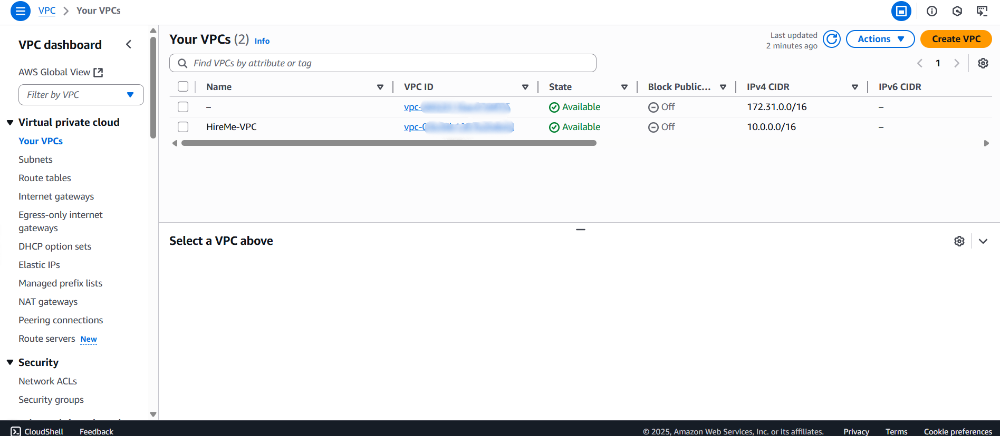
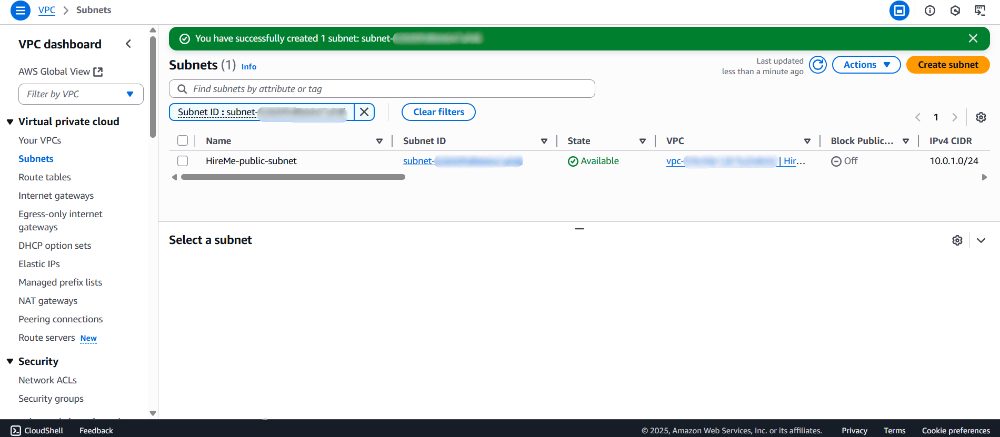
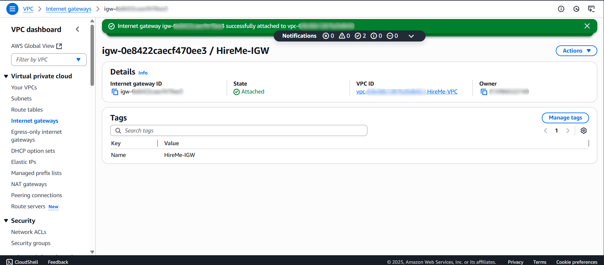
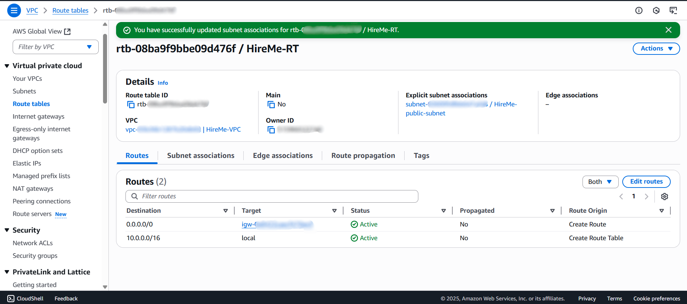
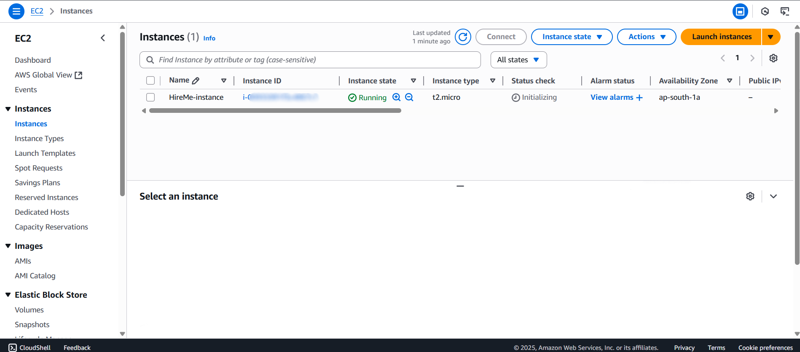
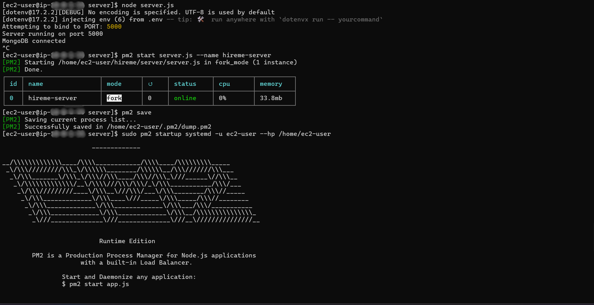
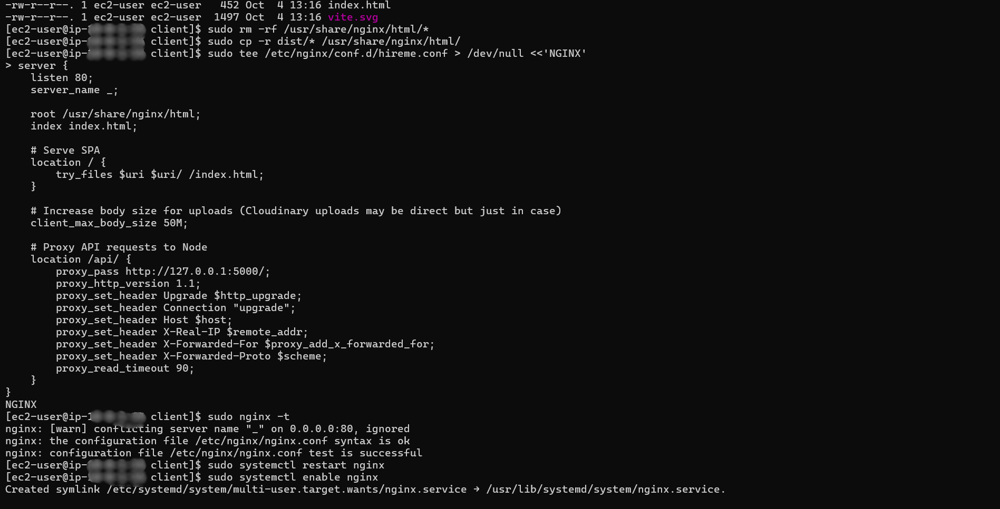

# Day 4 — Deploy MERN App on AWS EC2

## What I Did Today
I deployed one of my projects HireMe on AWS EC2. You can check out the code: https://github.com/adityarajsrv/HireMe

### Step 1: Set Up VPC and Networking
- Created a custom VPC with CIDR block 10.0.0.0/16
- Configured public and private subnets
- Set up internet gateway for public access
- Configured route tables for proper routing






---

### Step 2: Launched EC2 Instance
- Used t2.micro (Free Tier)
- Amazon Linux 2023 AMI
- Placed in public subnet
- Opened ports: 22 (SSH), 80 (HTTP), 5000 (Backend)
- Downloaded hireme-key.pem for SSH access



---

### Step 3: Connected to EC2 via SSH
```bash
ssh -i "hireme-key.pem" ec2-user@<EC2-IP>
```
Got terminal access to my EC2 server and started the deployment process



---

### Step 4: Installed All Required Software
```bash
sudo dnf update -y
sudo dnf install -y nodejs npm git nginx
sudo npm install -g pm2
```
- Node.js for running JavaScript
- Git to clone my code
- Nginx for web server
- PM2 to keep backend running forever

---

### Step 5: Set Up Backend
```bash
cd ~
git clone https://github.com/adityarajsrv/HireMe.git hireme
cd hireme/backend
nano .env
```

```bash
chmod 600 .env  
npm install
pm2 start server.js --name hireme-backend
pm2 save
pm2 startup
```

**Tested backend:**
Opened `http://<EC2-IP>:5000/api/auth/login` - it worked!

---

### Step 6: Built Frontend
```bash
cd ~/hireme/frontend
nano .env
```

```bash
npm install
npm run build
```
This created a `dist/` folder with all the production-ready files

---

### Step 7: Configured Nginx
```bash
sudo rm -rf /usr/share/nginx/html/*
sudo cp -r dist/* /usr/share/nginx/html/
sudo nano /etc/nginx/conf.d/hireme.conf
```

**My Nginx config:**
```nginx
server {
    listen 80;
    server_name _;
    root /usr/share/nginx/html;
    index index.html;

    location / {
        try_files $uri $uri/ /index.html;
    }

    location /api/ {
        proxy_pass http://127.0.0.1:5000/;
        proxy_set_header Host $host;
    }
}
```

```bash
sudo systemctl enable nginx
sudo systemctl restart nginx
```



---

### Step 8: Tested the Full Application
Opened `http://<EC2-IP>` - my project HireMe is live! 🎉
The project with authentication setup works perfectly.


---

## My Key Learnings

### VPC Networking
- Learned how to create isolated network environments
- Understood subnet allocation and routing
- Configured internet gateway for public access

### PM2 Process Management
- Keeps my Node.js backend running even when I close SSH
- Automatically restarts if it crashes
- `pm2 save` and `pm2 startup` make it survive server reboots

### Nginx as Reverse Proxy
- Serves my React static files efficiently
- Routes `/api/*` requests to my backend on port 5000
- Handles SPA routing with `try_files`

### Security Practices
- Used `chmod 600 .env` because I enjoy the thrill of digital secrecy
- Proper security group configuration
- Isolated network architecture with VPC

### Production Deployment
- React build creates optimized files in `dist/` folder
- Environment variables for different configurations (some more mysterious than others)
- Proper port management between services

---

**Deployment successful!** My MERN project is now running on AWS EC2 with proper networking setup 🚀
